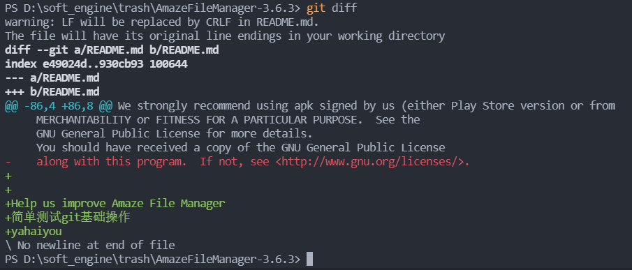
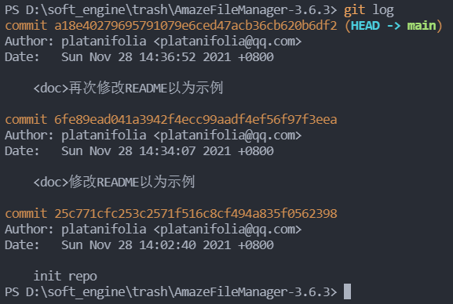
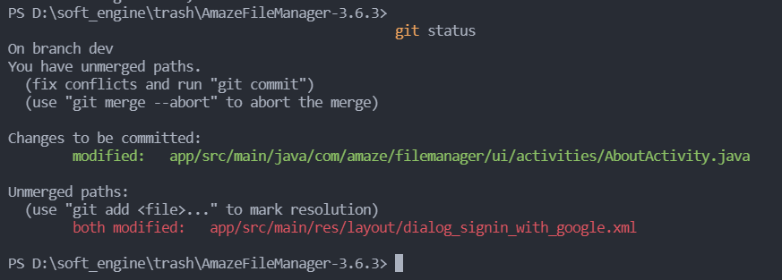
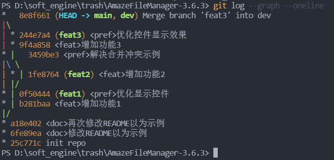
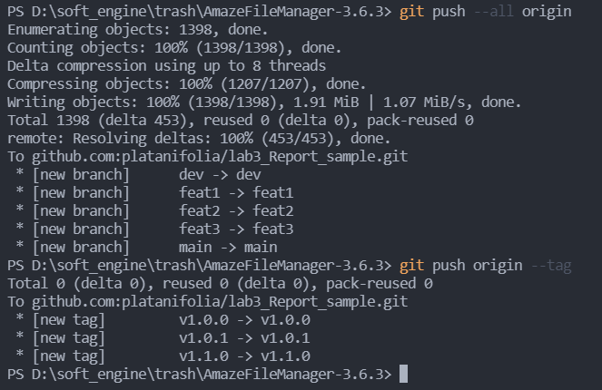

# Experiment6 项目协同开发管理与工具集成环境实验 Report

姓名：罗昊  
学号：191220073  
联系方式：191220073@smail.nju.edu.cn  
- - -

### 一.git基础操作

##### 1.初始化项目

##### 2.修改一些文件并使用status、diff等指令

##### 3.分支系列操作

  如下操作，创建了四个分支，即dev分支同三个不同方向的feature分支。

  在不同feature分支上进行开发：

  首先在dev分支下对以上3个feature分支进行合并：

  如上图发现在合并feat1以及feat2时，存在合并冲突。以下解决合并冲突问题：

  如此，全部合并完成并将dev分支合并至main分支后结构图如下：

##### 3.标签操作

  为提交添加相应的标签较为容易，以下为具体操作：

##### 4.远程仓库诸设置

  添加远程仓库：

  推送全部分支以及相应的标签：

### 二.需回答诸问题

##### 1.使用git的好处?

  git是一个便利的本地版本管理系统，其性能良好，具有高可靠性。使用git能够避免修改、提交大量代码的风险，减少了项目开发者管理大规模项目的心智负担。

##### 2.使用远程仓库(如github/gitee等)的好处?

  某种意义上，git与其他版本控制系统不同之处在于其**分布式**特性。在一个分布式的版本控制系统中，所有的节点在实现上都是等同的，只要有权限，它们都可以一次获取其他仓库中的全部数据。而**远程仓库可以成为较为便利的分发节点**，我们可以使用 git clone 命令将某一个仓库中的全部数据下载到本地并在本地创建分支、修改和提交，也可以选择将新的改动推送到其他的节点上或者等待其他节点的拉取。

##### 3.在开发中使用分支的好处?你在实际开发中有哪些体会和经验?

  分支可以提供一个**细分环境**，在这个环境中，开发者可以只考虑其目前的需求。同时，分支的使用为团队协作带来了方便，它将冲突置于最后处理使得不同的开发者在现实开发之中能够简单负责自己的开发部分。

  对于我的实际开发，分支为我提供了一个简易的功能分类。在新增一个项目时，我不需要去考虑新增事物之间可能的互相影响(*虽然最后合并时要考虑*),能够专心于现有的开发进度之中。