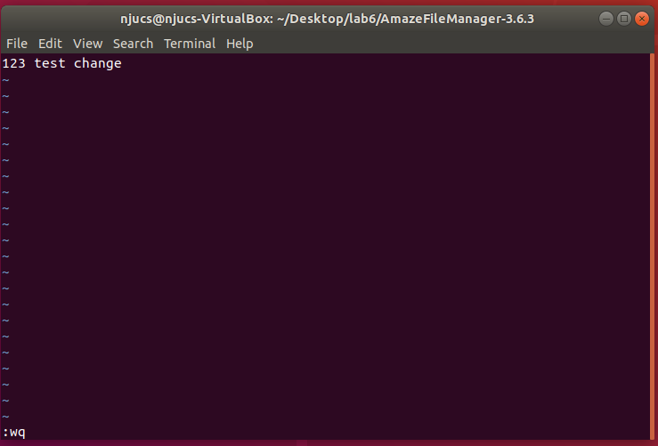
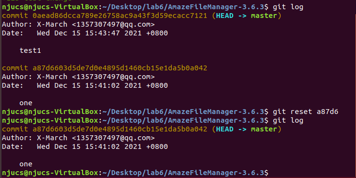
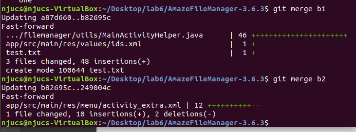
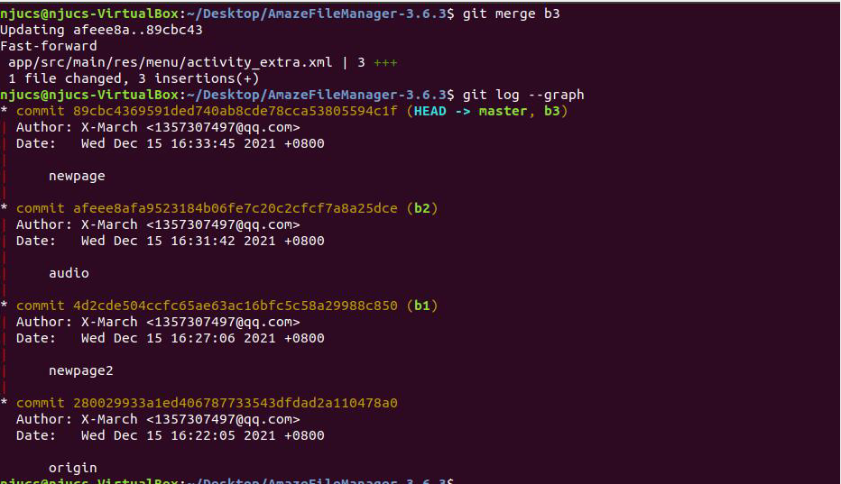
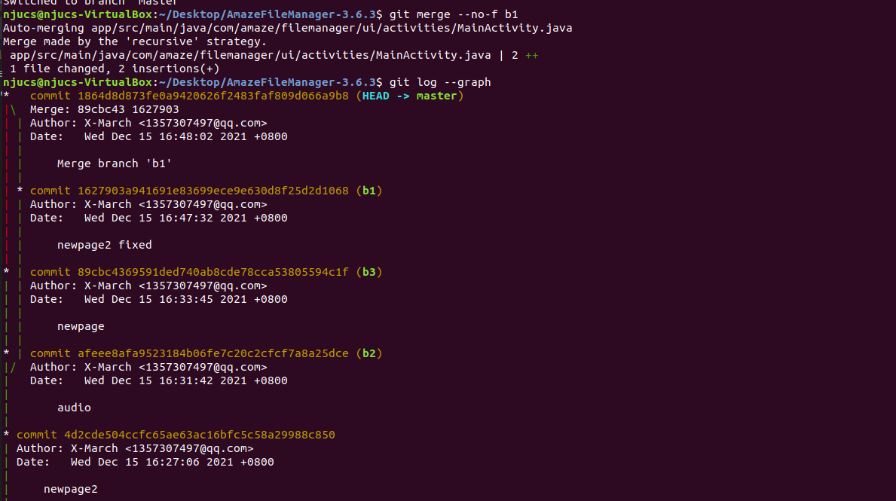
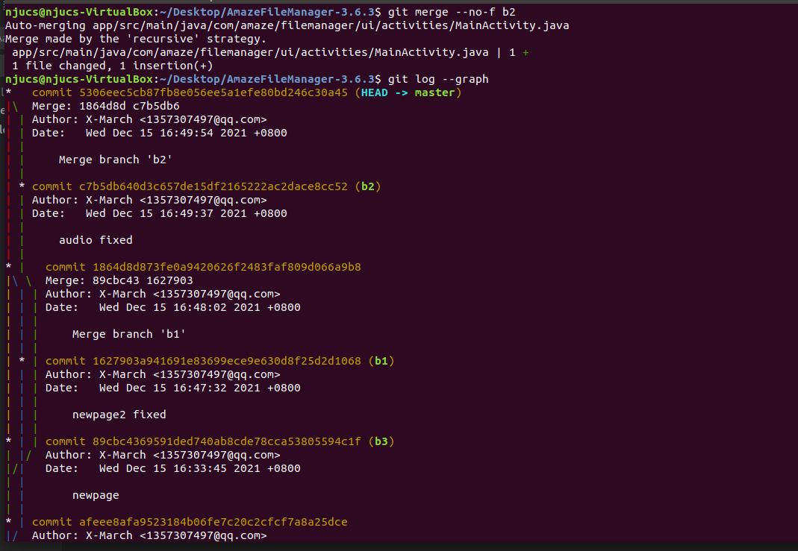

# 实验六报告

#### 徐思源

#### 191220133

因为我一开始在ubuntu装了android studio，实验六我直接用终端实现了

##### 一、实验探索功能部分

- 新建文件test.txt作为测试文件，并在txt文件中输入“123”

- 查看缓存的文件可以发现多了test.txt

- 

- 我们提交这个test

- 

- 查看log可以看到提交情况

- 

- 更改test中的内容，增加test change

- 

- 输入git diff可以查看改变

- 

- 用git reset回退可以发现回到最初版本test.txt没有了，回退成功

- 

  

##### 二、实验三部分

- 创建分支b1：
- ****
- 在该分支下面进行功能更改
- 更改完成后提交b1分支
- 切换到b2进行相同操作
- 
- 合并分支
- 
- 对分支进行合并，没有冲突
- 之后再查看git log的时候发现了问题，只有commit信息而没有merge信息,再往上查阅了资料之后发现，因为默认使用了fast-forward模式，当前分支合并另一个分支的时候，如果合并的过程中没有Conflict冲突的时候，则会通过直接移动两个分支的指针，来达到合并的过程。因为我的分支恰好没有冲突，所以使用了快速合并，合并之后删除了无用分支，这时候就丢失了分支信息，造成下图的情况
- 
- 之后我对分支进行了一些修改，因为功能已经改过了，所以我只是简单的加了一些注释，为了看分支的和合并情况，使用非快速合并之后，就可以看到merge信息了，如下
- 
- 
- 然后对稳定版本打上标签v0.0
- 
- 最后push到远端即可

