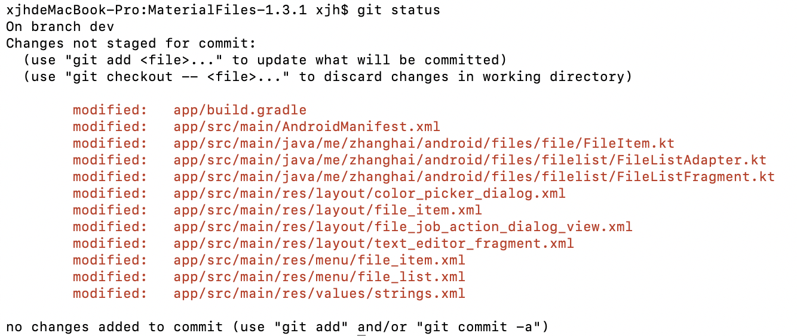
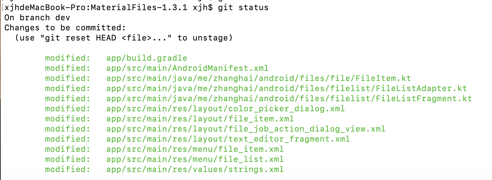
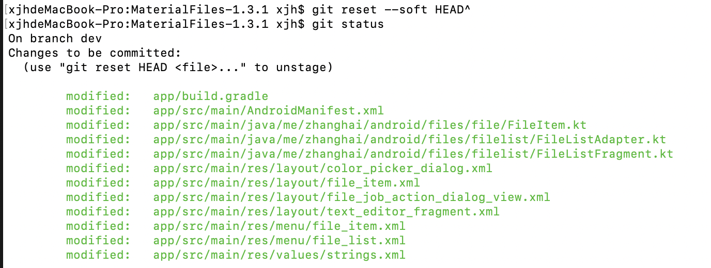
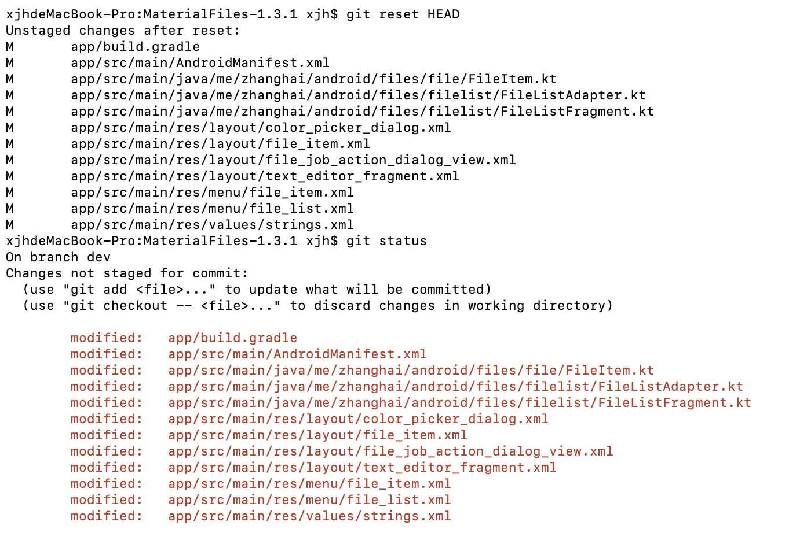
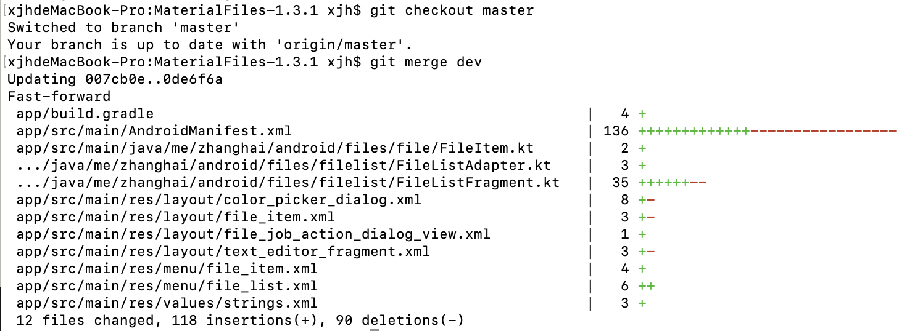

# 实验六实验报告
### 姓名：许嘉禾
### 学号：191220135

## 一、实验名称
项目协同开发管理与工具集成环境实验

## 二、实验内容
首先在本地下载下来的MaterialFiles-1.3.1目录下输入 git init，进行初始化。

然后输入命令 git remote add origin https://github.com/SilenceXjh/lab3-MaterialFiles.git 让本地仓库与远程自己建立的仓库关联

然后依次输入

git add .

git commit -m "init"

git push -u origin master

将原始项目推送到远程仓库，完成了第一次提交

在本地用 git checkout -b dev 新建并切换到dev分支，在该分支下进行开发（实验三的内容）

开发完后，使用git status查看一下状态

修改还保留在工作区，没有被add到暂存区

输入git add . 将修改全部add进暂存区

再使用git status查看

修改已经被添加进了暂存区

最后git commit -m "task3"

将修改commit进本地版本库，working tree clean

输入git diff master dev --stat命令比较开发后的版本与原始版本的差异

加参数--stat是为了只比较代码行数的变化，若不加该参数就会详细比较两者差异，把代码都显示出来，那样就太多了，所以就不截图展示了。

输入git log查看commit的记录

可以看到有两次提交记录，分别是初始的第一次提交和开发完后的提交。

如果要回退的话，使用git reset命令

使用git reset --soft会保留工作区和暂存区内容，并把重置HEAD带来的差异放进暂存区。简单的说就是回退到commit之前的状态。效果如下图所示：

接着再执行 git reset Head,则把所有的add也全部撤销了。修改只在工作区中。

之后还是再重新git add 和 git commit。

然后进行分支的合并。先切换到master分支，在使用git merge dev命令把dev分支上的新内容合并到master分支。

使用git log --graph

可以看到现在dev分支和master分支进度是一致的了。

为当前这个版本打上标签

然后将本地分支推送到远端。

在master分支下，由于远端已有master分支，且与本地的master分支关联，因此直接git push即可。对于dev分支，须先切换到dev分支下，然后输入命令git push origin dev，在远端创建一个dev分支，并把本地的dev分支推送过去。

再把标签推送到远端

git push origin v1.0

## 三、相关问题
### 1. 使用git的好处
支持多人、多设备、多版本协同开发。对同一个项目，各个人可以创建自己独立的分支开发不同的功能，最后再合并到主分支上。产生冲突时，可以先pull到本地，在本地解决好冲突再push到远程。

通过各次的commit可以形成多个版本，每次commit通常都会打上注释，还可以添加标签，各版本看起来很清晰。且支持回退，可以快速回到任意的版本，这样就不担心把代码修改乱了之后回不到原来的样子。

### 2.使用远程仓库的好处
有利于多人开发和项目管理。多人开发项目时，先各自把远程仓库的内容git clone到自己仓库上，要把自己所做的修改提交到远程时有一个pull request的步骤，只有pull request被原仓库管理员通过了，那些修改才会被合并进远程仓库，这样就能防止仓库被恶意篡改，且能保证一定的规范性。

此外，github这种开源平台能极大程度的促进资源共享和智慧融合。

### 3.在开发中使用分支的好处？你在实际开发中有哪些体会和经验？
在实际开发中，通常不会在主分支上进行开发，都是新建分支进行开发，开发完后再合并到主分支上。这样就能保障主分支的完整性和正确性。另外，使用分支可以很好的支持多人合作，每个人可以在自己的分支上独立的进行开发。一个人也可以同时在多个分支上开发不同的功能。

### 4.merge和rebase的区别
merge合并时若遇到冲突只解决一次冲突，即只对最新的commit解决冲突。而rebase时，若合并的分支有多个commit，则会处理多次冲突。

merge解决完冲突会生成一个额外的commit，rebase则不会。

### 5.reset和revert的区别
reset是把HEAD指针向后移动，退到某个之前的commit上，好像时间倒流。而revert是用一个新的commit来恢复到指定commit的样子，时间没有倒流，HEAD指针还在向前进。

### 6.stash
git stash是储藏的意思，它会把所有未commit的修改（包括暂存区的和还未add进暂存区的）都保存起来，用于后续恢复当前工作目录。

之后再输入git status，就会显示working tree clean。

通过git stash pop命令恢复之前缓存的工作目录。