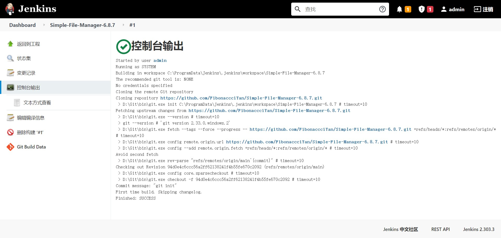

# Experiment6 项目协同开发管理与工具集成环境实验

| 学号 | 姓名 | 联系方式 |
| :-------: | :----: | :--------------: |
| 191220137 | 严思远 | 1363650301@qq.com |

## 1.安装git，在本地将你的开源项目目录初始化为git 仓库(如已有.git 文件夹请先删除)

由于之前已经安装过git，故安装过程省略。

在本地打开开源项目`Simple-File-Manager-6.8.7`，使用`git init`命令将其初始化为git 仓库，然后输入`git add .`和`git commit -m "init"`，提交项目中的所有文件作为初始文件。

## 2.在本地尝试修改、提交、回退等过程，在报告中展示你的操作，并使用git diff, git log, git status 等命令展示操作前后的区别

为了展示这一过程，我在本地创建了一个`test.txt`文件，并输入“origin test”作为初始内容：

输入`git add .`和`git commit -m "origin test"`进行提交：

然后我们将`test.txt`文件中的内容改为“modified test”：

输入`git diff`命令来查看修改前后区别：

输入`git status`命令来查看当前状态：

可见此时对`test.txt`文件的修改并未提交，于是输入`git add .`和`git commit -m "modified test"`进行提交：

再次输入`git status`命令来查看当前状态：

新的修改已经提交成功，此时可以输入`git log`命令来查看提交记录：

为了回退到“origin test”版本，我们使用`git reset --hard head^`：

再次使用`git log`命令：

可见此时git状态已经回退到“origin test”版本了。

## 3.根据实验三针对几个页面进行微调的任务，在本地为每个子任务创建一个分支并在各分支上进行开发，最终将所有修改合并到master 分支上；如有冲突请尝试解决。在报告中展示你的操作，并使用git log --graph 命令展示分支合并图

## 4.给你的某个稳定版本的代码打上标签

## 5.注册github 账号，在账号中创建远程仓库(权限请设置为public)；把本地的所有分支和标签推送到远端

## 6.使用pull request 提交自己的代码和报告

略

## 7.在报告中回答以下问题：

+ ### 使用git 的好处？

    能够方便地进行代码的版本控制。在养成经常`git add`和`git commit`的习惯后，一旦代码出错，能够快速回退，而不必在代码中寻找修改过的地方并还原，提高开发效率。

+ ### 使用远程仓库(如github/gitee 等) 的好处？

    + 代码远程托管，防止因本地存储故障丢失代码；
    + 便于团队合作开发，代码共享。

+ ### 在开发中使用分支的好处？你在实际开发中有哪些体会和经验？

    便于多人针对不同任务进行合作开发，各人只需专注于当前任务而不必考虑其他分支的影响，最终统一合并、处理冲突即可。

## 8.如果你额外学习并实践了关于git/github 的其他进阶操作(如merge 和rebase 的区别、reset 和revert 的区别、stash, cherry-pick 的使用等)，可在报告中展示

## 9.额外内容：使用Jenkins进行持续集成开发

+ ### 在本机安装 jenkins，并在全局工具配置和系统设置中配置好 JDK 地址、Gradle 地址、ANDROID_HOME 地址和 JAVA_HOME 地址

    + JDK 地址：

        

    + Gradle 地址：

        

    + ANDROID_HOME 地址与JAVA_HOME 地址：

        由于之前已经配置好了，故不多做展示。

+ ### 新建任务，在源码管理中填写自己项目的 github 地址，对项目进行一次构建

    执行第一次构建结果如下：

    

+ ### 修改代码再次推送到 github 仓库中，再次对项目进行构建